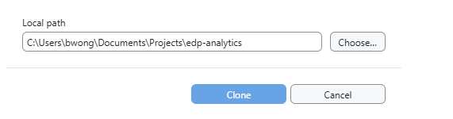
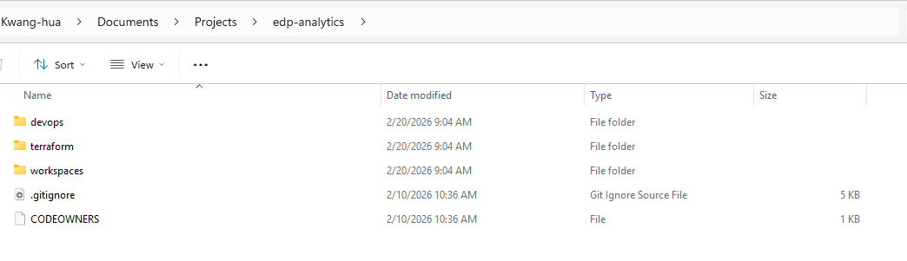
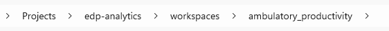
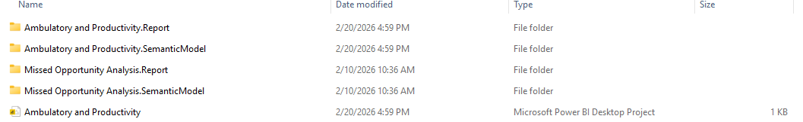
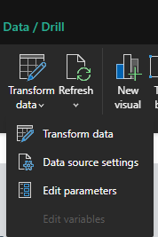
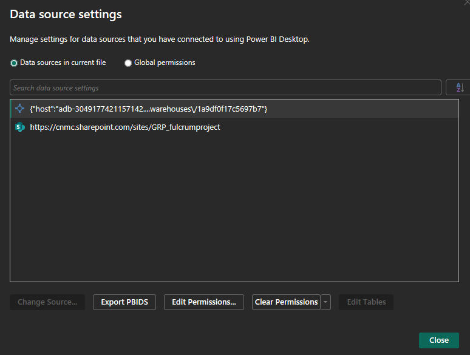
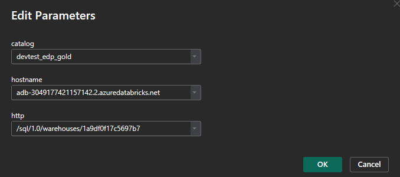
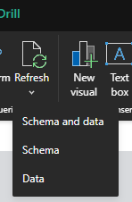

# EDP Analytics – Power BI Workspace Setup Guide

This repository contains analytics workspaces and Power BI projects for the **EDP Analytics** platform.

This guide walks contributors through:

1. Installing and configuring **GitHub Desktop**
2. Cloning the **`edp-analytics`** repository (**devtest** branch)
3. Locating **Power BI (.pbib)** workspace files
4. Connecting the Power BI semantic model to **Databricks SQL Warehouse**
---

## Table of Contents

- [Prerequisites](#prerequisites)
- [1. Install and Configure GitHub Desktop](#1-install-and-configure-github-desktop)
- [2. Clone the Repository (devtest Branch)](#2-clone-the-repository-devtest-branch)
- [3. Locate Power BI Workspace Files](#3-locate-power-bi-workspace-files)
- [4. Connect Power BI to the Databricks Semantic Layer](#4-connect-power-bi-to-the-databricks-semantic-layer)
- [Troubleshooting](#troubleshooting)
---

## Prerequisites

Before starting, ensure you have:

- A **GitHub account** with access to `Childrens-National-Hospital/edp-analytics`
- **Power BI Desktop** installed
- Access to the **team_data_product_management** Databricks SQL Warehouse
- Organizational authentication configured (Azure Active Directory / SSO)
---

## 1. Install and Configure GitHub Desktop

### 1.1 Download GitHub Desktop
Once signed into github, if you're not already on the home screen, find your way home by on the github logo on the top left corner:


Your home screen should have a link to download github desktop:


Otherwise, you can download GitHub Desktop from:
- https://desktop.github.com/download/


---

### 1.2 Install GitHub Desktop

1. Run the installer
2. Accept default installation settings
3. Launch GitHub Desktop after installation completes


---

### 1.3 Sign In to GitHub

1. Open **GitHub Desktop**
2. Navigate to:
   - **File → Options → Accounts** (Windows)
   - **GitHub Desktop → Settings → Accounts** (Mac)
3. Click **Sign in to GitHub.com**
4. Complete authentication in your browser

✅ GitHub Desktop is now connected to your GitHub account.

---

## 2. Clone the Repository (devtest Branch)

Repository URL (devtest branch):
---

### 2.1 Clone Using GitHub Desktop

1. In your browser, click **Code**
2. Select **Open with GitHub Desktop**
3. Choose a local folder (or accept the default)
4. Click **Clone**


---

### 2.2 Verify Branch Selection

In GitHub Desktop, confirm the active branch is:

```text
devtest
```

If not:

1. Click **Current Branch**
2. Select **devtest**


---

## 3. Locate Power BI Workspace Files

### 3.1 Open the Repository Locally

In GitHub Desktop:

- **Repository → Show in Explorer** (Windows)
- **Repository → Show in Finder** (Mac)
- 

---

### 3.2 Navigate to the Workspaces Directory

GitHub reference:
- https://github.com/Childrens-National-Hospital/edp-analytics/tree/devtest/workspaces
```text
edp-analytics/
└── workspaces/
```

Workspace files are stored under:

---

### 3.3 Identify the Power BI Project File (.pbib)

Within the `workspaces/` directory, locate a file ending in:

```text
.pbib - aka: Microsoft Power BI Desktop Project
```

Example:

```text
Ambulatory and Productivity.pbib
```

This `.pbib` file typically contains:



---

## 4. Connect Power BI to the Databricks Semantic Layer

### 4.1 Open the Power BI Project

Open the `.pbib` file by:

- Double‑clicking the file
- **OR** Right‑click → **Open with → Power BI Desktop**
---

### 4.2 Open Data Source Settings

In Power BI Desktop:

1. Select **Transform data**
2. Click **Data source settings**


---

### 4.3 Update the Databricks Connection

1. Select the existing **Databricks** data source
2. Click **Change Source**


---

### 4.4 Enter Databricks SQL Warehouse Connection Details

Use the following values exactly:

**Server Hostname**

```text
adb-3049177421157142.2.azuredatabricks.net
```

**HTTP Path**

```text
/sql/1.0/warehouses/1a9df0f17c5697b7
```



This connects the semantic model to the **team_data_product_management** SQL Warehouse.
---

### 4.5 Authenticate
If necessary, when prompted:

- Select **Microsoft account / Azure Active Directory**
- Sign in using your organizational credentials
---

### 4.6 Apply Changes and Refresh

1. Click **Close & Apply**
2. Click **Refresh**



✅ If successful, report visuals will populate using data from Databricks.
---

## Troubleshooting
Find me if you have errors.

| Issue | Resolution |
|------|------------|
| Authentication failure | Confirm you have access to the Databricks SQL Warehouse (and re-authenticate in **Data source settings → Edit Permissions**) |
| Missing tables/views | Verify the correct catalog and schema are used (and that your identity has access) |
| Refresh errors | Re-check the **Server Hostname** and **HTTP Path** for typos |
---

## Summary

You have now:

- ✅ Installed and configured GitHub Desktop
- ✅ Cloned the `edp-analytics` repository (`devtest` branch)
- ✅ Located Power BI workspace `.pbib` files
- ✅ Connected the semantic model to the Databricks SQL Warehouse

You are ready to develop and analyze Power BI content backed by Databricks.

